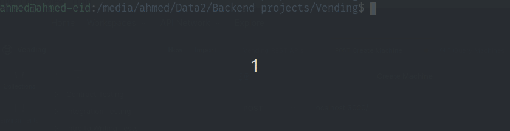
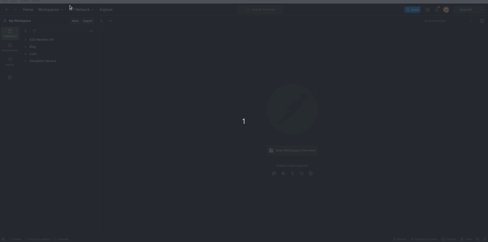

<a name="readme-top"></a>


<h1 align="center">Vending Machine API</h1>
<p align="center">
This API provides endpoints for a vending machine that is accessible to both buyers and sellers. The API includes endpoints for adding, updating, and removing products, as well as depositing coins and making purchases. Authentication and authorization are used to control access to the endpoints based on user role (buyer or seller), and caching is implemented to improve performance. The API requires authentication tokens for requests that require a specific role (buyer or seller), and uses a time-to-live (TTL) value to cache frequently-requested queries.
</p>

<p align="center">

  [![Contributors][contributors-shield]][contributors-url] [![Stargazers][stars-shield]][stars-url] [![Issues][issues-shield]][issues-url] [![MIT License][license-shield]][license-url] [![LinkedIn][linkedin-shield]][linkedin-url]

</p>

# 📗 Table of Contents

- [📖 About the Project](#about-project)
  - [🛠 Built With](#built-with)
    - [Tech Stack](#tech-stack)
    - [Key Features](#key-features)
- [💻 Getting Started](#getting-started)
  - [Prerequisites](#prerequisites)
  - [Environment Variables](#environment-variable)
  - [Setup](#setup)
  - [Install](#install)
  - [Usage](#usage)
- [📖 API Reference](#api-reference)
  - [Swagger](#swagger)
  - [Postman](#postman)
- [👥 Authors](#authors)
- [🤝 Contributing](#contributing)
- [⭐️ Show your support](#support)
- [🔭 Up next](#up-next)
- [💎 Lesson Learned](#💎-lessons-learned)

#   Vending <a name="about-project"></a>
## 🛠 Built With <a name="built-with"></a>

### Tech Stack <a name="tech-stack"></a>

<details>
  <summary>Server</summary>

  [![Node][Node.js]][Node-url] [![Express][Express.js]][Express-url] [![JWT][JWT]][JWT-url] [![NPM][NPM]][NPM-url] 
</details>

<details>
<summary>Database</summary>

  [![MongoDB][MongoDB]][MongoDB-url] [![Redis][Redis]][Redis-url] 
</details>

<details>
<summary>DevOps</summary>

  [![Docker][Docker]][Docker-url] [![Docker Compose][Docker Compose]][Docker Compose-url] 
</details>

<details>
<summary>Docs</summary>

  [![Postman][Postman]][Postman-url] [![Swagger][Swagger]][Swagger-url] 
</details>

### Key Features <a name="key-features"></a>


- [x] **Uses authentication and authorization to control access based on user role.**
- [x] **Validates requests with Joi and supports CRUD operations for products, coins, purchases, and charges.**
- [x] **Allows admins to create machines at specific locations and add products.**
- [x] **Supports geolocation to find the nearest machine or product.**
- [x] **Implements caching for improved performance using Redis.**

<p align="right">(<a href="#readme-top">back to top</a>)</p>

## 💻 Getting Started <a name="getting-started"></a>
To get a local copy up and running, follow these steps.

### Prerequisites ❗<a name="prerequisites"></a>
In order to run this project you need:

<p>
 <a href="https://skillicons.dev">
        
    </a>
    <a href="https://www.npmjs.com/"></a>
 
 ##### OR
 <a href="https://skillicons.dev">
        
    </a>
    <a href="https://docs.docker.com/compose/"></a>
 </p>

### Environment Variables  :key: <a name="environment-variable"></a>

To run this project, you will need to add the following environment variables to your .env file

`PORT` : port where you application start on it <number>

`ACCESS_TOKEN_SECRET` : string, access token secret <string> (Example: JwtKey)

`MONGODB_URI` : string, mongo database uri <string> ( Example: mongodb://127.0.0.1/vending).

`REDIS_HOST` : string, redis database host ( Example: localhost ).

`REDIS_PORT` : number, redis working port (Example: 6379)

`SALT_WORK_FACTOR` : number of rounds to create salt for hashing<number> ( Example: 10 )

### Setup ⬇️ <a name="setup"></a> 

Clone this repository to your desired folder:
 
 ```bash
 cd my-folder
 git clone https://github.com/ahmedeid6842/Vending.git
```

### Install :heavy_check_mark: <a name="install"></a>
Install this project with **NPM**:

 ```bash
 npm install
```

Install this project with **Docker-compose**:
```bash
docker-compose build
```

### Usage 🤿 🏃‍♂️ <a name="usage"></a>

- To run the project using **NPM**: 
```bash
  npm start
  npm run dev #if your are a developer 
```


- To run the project using **Docker-compose**: 
```bash
  docker compose up -d
```


<hr>

> #### After following the above steps you can now use Vending API

Import this [JSON file](Vending%20REST%20APIs.postman_collection.json) into Postman, and you will be able to use all REST APIs.



If you don't know how to do it, watch this [video](https://www.youtube.com/watch?v=bzquMXmCLUQ).

----------------
> #### Importing data to MongoDB

If you would like to import data to mongo collection you will 
1. Go to you project your project folder path 
```bash
cd ./your-folder
```
2. Run the following commands 
```bash 
mongoimport --db vending --collection users --file import/users.json
mongoimport --db vending --collection machines --file import/machines.json
mongoimport --db vending --collection products --file import/products.json
```


<p align="right">(<a href="#readme-top">back to top</a>)</p>


## API Reference  <a name="api-reference"></a>

### Swagger 🤩 
Here it's swagger REST API reference : **[Swagger Docs Vending](https://app.swaggerhub.com/apis/ahmedeid6842/Vending/1.0.0)**


### Postman 🤩 
Here it's Postman docs : **[Postman docs Vending](https://documenter.getpostman.com/view/10444163/2s93sabZ84)**


<p align="right">(<a href="#readme-top">back to top</a>)</p>


## 👤 Author <a name="author"></a>
**Ahmed Eid 🙋‍♂️**
- Github: [@ahmedeid6842](https://github.com/ahmedeid6842/)
- LinkedIn : [Ahmed Eid](https://www.linkedin.com/in/ahmed-eid-0018571b1/)
- Twitter: [@ahmedeid2684](https://twitter.com/ahmedeid2684)
<p align="right">(<a href="#readme-top">back to top</a>)</p>


## 🤝 Contributing 

##### Contributions are always welcome💟, and as a thank you, vending will give you something for free 😅.

<div align="center">

</div>

<p align="right">(<a href="#readme-top">back to top</a>)</p>


## ⭐️ Show your support <a name="support"></a>

If you find this project helpful, I would greatly appreciate it if you could leave a star! 🌟 💟

<p align="right">(<a href="#readme-top">back to top</a>)</p>

## 🔭 **Up next**

- [ ] **Forget password:** 💁
- [ ] **Real time services with socket.io**  📣
- [ ] **allow adding products' images** 📷
- [ ] **Using Microservice** ✨

<p align="right">(<a href="#readme-top">back to top</a>)</p>


## 💎 Lessons Learned
- handle edge cases
- Build a strong authorization authentication 
- There is always something new to learn 👨‍💻.

<p align="right">(<a href="#readme-top">back to top</a>)</p>


[contributors-shield]: https://img.shields.io/github/contributors/ahmedeid6842/Vending.svg?style=for-the-badge
[contributors-url]: https://github.com/ahmedeid6842/Vending/graphs/contributors
[forks-shield]: https://img.shields.io/github/forks/ahmedeid6842/Vending.svg?style=for-the-badge
[forks-url]: https://github.com/ahmedeid6842/Vending/network/members
[stars-shield]: https://img.shields.io/github/stars/ahmedeid6842/Vending.svg?style=for-the-badge
[stars-url]: https://github.com/ahmedeid6842/Vending/stargazers
[issues-shield]: https://img.shields.io/github/issues/ahmedeid6842/Vending.svg?style=for-the-badge
[issues-url]: https://github.com/ahmedeid6842/Vending/issues
[license-shield]: https://img.shields.io/github/license/ahmedeid6842/Vending.svg?style=for-the-badge
[license-url]: https://github.com/ahmedeid6842/vending/blob/master/MIT.md
[linkedin-shield]: https://img.shields.io/badge/-LinkedIn-black.svg?style=for-the-badge&logo=linkedin&colorB=555
[linkedin-url]: https://www.linkedin.com/in/ahmed-eid-0018571b1/

[Node.js]: https://img.shields.io/badge/Node.js-339933?style=for-the-badge&logo=node.js&logoColor=white
[Node-url]: https://nodejs.org/en


[Express.js]:https://img.shields.io/badge/Express.js-000000?style=for-the-badge&logo=express&logoColor=white
[Express-url]: https://expressjs.com/

[JWT]:https://img.shields.io/badge/JWT-0072bb?style=for-the-badge&logo=json-web-tokens&logoColor=b437ce
[JWT-url]: https://jwt.io/


[Cookies]:https://img.shields.io/badge/Cookies-FFA500?style=for-the-badge&logo=🍪&logoColor=white
[Cookie-url]: https://en.wikipedia.org/wiki/HTTP_cookie

[MongoDB]: https://img.shields.io/badge/MongoDB-47A248?style=for-the-badge&logo=mongodb&logoColor=white
[MongoDB-url]: https://www.mongodb.com/

[Redis]: https://img.shields.io/badge/Redis-DC382D?style=for-the-badge&logo=redis&logoColor=white
[Redis-url]: https://redis.io/

[Docker]: https://img.shields.io/badge/Docker-2496ED?style=for-the-badge&logo=docker&logoColor=white
[Docker-url]: https://www.docker.com/

[Docker Compose]:https://img.shields.io/badge/Docker_Compose-2496ED?style=for-the-badge&logo=docker&logoColor=white
[Docker Compose-url]: https://docs.docker.com/compose/


[Postman]: https://img.shields.io/badge/Postman-FF6C37?style=for-the-badge&logo=postman&logoColor=white
[Postman-url]: https://www.postman.com/

[Swagger]:https://img.shields.io/badge/Swagger-85EA2D?style=for-the-badge&logo=swagger&logoColor=black
[Swagger-url]: https://swagger.io/

[NPM]: https://img.shields.io/badge/npm-CB3837?style=for-the-badge&logo=npm&logoColor=white
[NPM-url]: https://www.npmjs.com/